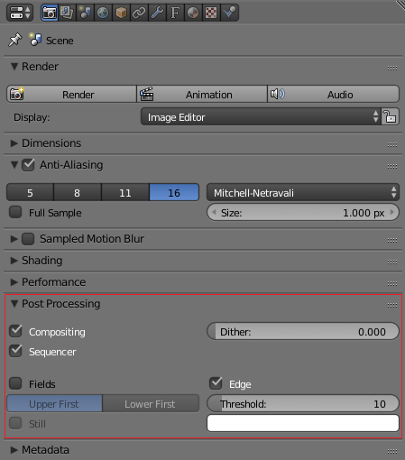

Icon Notes
==========

The PNG files were exported from the Blender (KTX_app) and SVG (KTX_document) masters. 

Blender 2.78b was used to create `png/KTX_app.png`. When exporting `masters/KTX_app.blend`, a white outline was added by checking "Edge" in the Post Processing section of the camera tab of the Properties view and setting the color to white.

To open Properties, click the View menu near the bottom left of the Blender window and select the Properties view. At the top of the Properties amke sure the tab with a picture of a camera on it is selected.

The iOS icon set, `ios/Icons.xcassets/ktx_app.appiconset`, was created using the [MakeAppIcon](http://makeappicon.com) website which can be used for Android icons as well. The icon set sits in the subdirectory `Icons.xcassets` in order to be found by Xcode. When a symbolic link from the apps' existing Asset Catalogs to `ktx_app.appiconset` was tried, Xcode failed to read the icon. Copying it to the existing catalogs works but having multiple copies of the icon is unappealing. So the Xcode targets refer to this additional Asset Catalog. 

The Mac icon sets,`mac/*.icns`, were produced from the SVG or PNG files by [Image2Icon](https://itunes.apple.com/us/app/image2icon-make-your-own-icons/id992115977?mt=12).

The Windows (`win/*.ico`) files were produced from the SVG or PNG files by [Axialis IconWorkshop](http://www.axialis.com/iconworkshop/).

[Axialis IconWorkshop](http://www.axialis.com/iconworkshop/) was originally used to create `.icns` files but the files produced had some strange images at certain sizes. The cause has not been investigated.

[Image2Icon](https://itunes.apple.com/us/app/image2icon-make-your-own-icons/id992115977?mt=12) can be used to create .ico files but an in-app purchase is required to enable this function. Furthermore the size is limited to 256x256. Windows 10 wants 768x768.

[Axialis](http://www.axialis.com/iconworkshop/) and [Image2Icon](https://itunes.apple.com/us/app/image2icon-make-your-own-icons/id992115977?mt=12) can also be used to create iOS icon sets.

